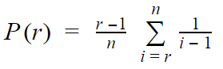

# When is it right to settle down?

This is a question for the most of us. After we've dated someone a few times we might want to decide if that person is worthwile to settle down with, or what if there is someone better just around the corner?

In this project I attempt to answer that question with Mathematics, with the method proposed by the book "Mathematics of Love" by "Hannah Fry".

## Optimal Stopping Theory

As it turned out, this problem is similar to one of the problems learned in Mathematics named **The secretary problem**. The secretary problem is one of many names for a famous problem of the optimal stopping theory. The problem has been studied extensively in the fields of applied probability, statistics, and decision theory.

The basic form of the problem is the following: 

- Imagine an administrator willing to hire the best secretary out of n rankable applicants for a position.
- The applicants are interviewed one by one in random order.
- A decision about each particular applicant is to be made immediately after the interview.
- Once rejected, an applicant cannot be recalled.
- During the interview, the administrator can rank the applicant among all applicants interviewed so far, but is unaware of the quality of yet unseen applicants.
- The decision must be made immediately.

From [Wikipedia](https://en.wikipedia.org/wiki/Secretary_problem):

> The question is about the **optimal strategy (stopping rule)** to **maximize the probability** of selecting the best applicant. If the decision can be deferred to the end, this can be solved by the simple maximum selection algorithm of **tracking the running maximum (and who achieved it)**, and **selecting the overall maximum at the end**.

> The problem has an elegant solution. The optimal stopping rule prescribes always **rejecting the first n/e applicants** after the interview (where e is the base of the natural logarithm) and then **stopping at the first applicant who is better than every applicant interviewed so far** (or continuing to the last applicant if this never occurs). Sometimes this strategy is called the **1/e stopping rule**, because the probability of stopping at the best applicant with this strategy is about **1/e** already for moderate values of **n**.


The formula for this is relatively simple:



Where:
P(r) = Best person
n = Potential lovers
r = Rejected potential lovers

For example: 10 potential lovers, rejected 4 so far, so P(5) = 4/10 *(1/4 + 1/5 + 1/6 + 1/7 + 1/8 + 1/9) = 0.398 or 39.8% for the chance that the 5th person is the one, and P(6) = 5/10 *(1/5 + 1/6 + 1/7 + 1/8 + 1/9) = 0.373 or 37.3% for the chance that the 6th person is the one.


```{r inclusion, echo=FALSE, message=FALSE, error=FALSE}
suppressWarnings(require(ggplot2))
suppressWarnings(require(pander))
theme_set(theme_bw())
```

```{r secretary_data_function, echo=FALSE}
secretary_data <- function(n) {  
  # r is number of rejected people.
  # p_of_r is the probability of that rejected person r is the one.
  r <- c()
  p_of_r <- c()
  for (i in 1:n) {
    r[i] = i
    e = 0
    for (j in i:n) {
      if (j == 1) {
        e = 0
      }
      else {
        e = e + (1 / (j - 1))
      }
    }
    p_of_r[i] <- ((i - 1) / n) * e
  }
  return(data.frame(r, p_of_r))
}
```

Let's try this out, say if I know I'm gonna meet 10 people:

```{r test_with_10, echo=FALSE, results='asis'}
df = secretary_data(10)
pandoc.table(df)
```

The above table means the first person has 0% chance to be the perfect person, the second person has 28.29% chance, third person 36.58%, etc.

```{r echo=FALSE}
people_a_year = 4
age_now = 29
age_end = 40
total_people = (age_end - age_now) * people_a_year
```

Assumming that I will date about 4 people in a year from now (age `r age_now`, gosh I'm old) to `r age_end` (if God forsake I haven't met the one by the age of `r age_end`), that would get me `r total_people` women in total in my life.

```{r plot_n, echo=FALSE, cache=TRUE, cache.path = 'cache/', fig.path='figure/'}
df = secretary_data(total_people)
ggplot(aes(x = r, y = p_of_r), data = df) +
  geom_line(size=1) +
  xlab("n-th Rejected Person") +
  ylab("Chance that rejected person's The One") +
  scale_x_discrete(breaks=seq(0,44,2)) +
  scale_y_continuous(breaks=seq(0,0.4,0.05))
```

Max chance of perfect person (P(r)) of that number:
```{r max_chance, echo=FALSE}
paste0(formatC(100 * max(df$p_of_r)), "%")
```

And which person was it?
```{r optimal_person, echo=FALSE}
x <- which(df$p_of_r == max(df$p_of_r))
x_text <- paste(x, "th person", sep="")
x_text
```

So, at what is **the minimum** age would it be best for me to settle down with that assumption?

```{r settle_down_age, echo=FALSE}
age_settle_down <- age_now + (x/people_a_year)
age_text <- paste(age_settle_down, " years old", sep="")
age_text
```

```{r echo=FALSE}
min_people = 0
max_people = 8
lifetimes = 10000
```

To summarize, this strategy suggest me to date `r x` women and track their compatibility levels, but not to tie the knot with any one of them. Let's call that period 'Rejection Phase'. Then starting from the next one that comes through, if I find anyone better than these first dates I should seriously consider starting a family with her.

An astute reader would directly find several problems with the above analysis:

1. **What if my assumptions were wrong?** In a year, instead of constantly dating `r people_a_year` different people, I could end up with `r (max_people - 2)` to `r max_people` if lucky (or unlucky, depending on your perception), or `r min_people` people (maybe if in one of these years I ended up being in a little more serious relationship).
2. **What if the theory was wrong?** This is a more important question to answer. What if instead of the `r x`th person, the perfect person lies instead at the `r (x+1)`, `r (x+2)`, or `r (x-1)`th position? **How likely is it to find the perfect person with this theory?**

## Monte Carlo Analysis

In Mathematics, (I thought it was from Computer Science), they managed to come up with a cool name for "Random samples", it is called "Monte Carlo". Basically with this analysis method, we randomly create multiple samples computationally, and run our optimization algorithm on them.

In my specific case, I'll simulate, lets say **`r as.character(lifetimes)` lifetimes**, each with different number of women I meet each year, ranging from **`r min_people` to `r max_people`**.

Each lifetime simulation will have a pool of available partners with a random level of **compatibility**.

I will then see, if I :

1. **Reject x percentage** of people during each of these lifetimes, where x is 0 to 99% percent (i.e. pick the first one to pick the last one), while keeping track of their compatibility level,
2. then settle down with the best person I meet after this rejection phase,

how likely is it that I end up choosing the perfect person right after the rejection phase is done? Then keep this likelihood as **Percentage Chance of Success**.

**The question I'm trying to answer here is** to find the most optimal number of people I need to reject in order to allow me to meet with the best person, And the way I do it is by retrying my life `r as.character(lifetimes)` times and see if the ones I picked with this strategy were likely to be the top ones I could ever pick.


```{r better_round_function, echo=FALSE}
# To fix R bug: round(1.5) == 2 but round(8.5) == 8
round2 <- function(number) {
  return(round(number+0.000000000001))
}
```

```{r is_acceptable_function, echo=FALSE}
# Checks if given compat_level is acceptable(i.e. within the top x percent of
# everyone, if 0 then only take the top one)
is_acceptable <- function(compat_level, all_compat_levels, top_x = 0) {
  min_accepted = tail(sort(all_compat_levels),1)[[1]]
  if (top_x > 0) {
    tops = (tail(sort(all_compat_levels), round2(length(all_compat_levels) * top_x / 100))) 
    min_accepted = tops[[1]]
  }
  return (compat_level >= min_accepted)
}

test_is_acceptable <- function() {
  compats <- seq(1:100)
  result1 <- is_acceptable(100, compats)
  result2 <- is_acceptable(95, compats)
  result3 <- is_acceptable(96, compats, 5)
  result4 <- is_acceptable(95, compats, 5)
  
  # What if the values aren't integers
  compats <- seq(1:81)
  result5 <- is_acceptable(81, compats)
  result6 <- is_acceptable(80, compats)
  result7 <- is_acceptable(78, compats, 5)
  result8 <- is_acceptable(77, compats, 5)
  
  stopifnot(
    result1 == TRUE,
    result2 == FALSE,
    result3 == TRUE,
    result4 == FALSE,
    result5 == TRUE,
    result6 == FALSE,
    result7 == TRUE,
    result8 == FALSE
  )
}

test_is_acceptable()
```

```{r rejection_test, echo=FALSE}
rejection_test <- function(people_compats, top_x = 0) {
  s = c()
  # If I rejected n% of people, then find the next person that is better than the rejected ones,
  # do I end up with person with max compatibility?
  # Then make that into a True/False table
  for (n in 0:99) {
    pos <- (round2(length(people_compats) * n / 100) + 1)
    if (pos > length(people_compats)) {
      pos = length(people_compats)
    }
    max_score = max(people_compats[1:pos])
    pos_final = which(people_compats[-1:-pos] > max_score)[1] + pos

    if (length(pos_final) == 0 || is.na(pos_final)) {
      s[length(s)+1] <- FALSE
    }
    else {
      s[length(s)+1] <- is_acceptable(people_compats[[pos_final]],
                                      people_compats, top_x)
    }
  }
  return(s)
}

test_rejection_test <- function() {
  people_compats <- c(3, 5, 4, 8, 9, 5, 10, 1, 10, 3)
  results <- rejection_test(people_compats)
  # pos 1 = at 0% rejected
  # pos 2 = at 1% rejected
  # pos 15 = at 14% rejected
  # pos 100 = at 99% rejected
  # That's why we need to add 1.
  stopifnot(
    results[[1]] == FALSE,
    results[[34+1]] == FALSE,
    results[[35+1]] == TRUE,
    results[[45+1]] == TRUE,
    results[[85+1]] == FALSE,
    results[[99+1]] == FALSE,
    results[[100]] == FALSE
  )
  
  # With top x%
  people_compats <- c(3, 5, 4, 8, 9, 5, 10, 1, 10, 3)
  results <- rejection_test(people_compats, 30)
  # pos 1 = at 0% rejected
  # pos 2 = at 1% rejected
  # pos 15 = at 14% rejected
  # pos 100 = at 99% rejected
  # That's why we need to add 1.
  stopifnot(
    results[[1]] == FALSE,
    results[[24+1]] == FALSE,
    results[[25+1]] == TRUE,
    results[[45+1]] == TRUE,
    results[[85+1]] == FALSE,
    results[[99+1]] == FALSE,
    results[[100]] == FALSE
  )
}

test_rejection_test()
```

```{r simulation, echo=FALSE, cache=TRUE, cache.path = 'cache/', fig.path='figure/'}
set.seed(102)

# Boolean list of success / failure during each person .
successes_1 <- c()
successes_5 <- c()
successes_15 <- c()

for (i in 1:lifetimes) {
  # For each lifetime, create a random data
  # with randomized level of compatibilities of each person in each year.
  total_people = sum(sample(min_people:max_people, (age_end-age_now), replace=TRUE))
  people_compats = runif(total_people)
  
  successes_1 = append(successes_1, rejection_test(people_compats))
  successes_5 = append(successes_5, rejection_test(people_compats, 5))
  successes_15 = append(successes_15, rejection_test(people_compats, 15))
}
successes_1_m = t(matrix(successes_1, ncol = lifetimes))
successes_5_m = t(matrix(successes_5, ncol = lifetimes))
successes_15_m = t(matrix(successes_15, ncol = lifetimes))
chances_1_m = colSums(successes_1_m) / lifetimes
chances_5_m = colSums(successes_5_m) / lifetimes
chances_15_m = colSums(successes_15_m) / lifetimes
chances_df = data.frame(chances_1_m, chances_5_m, chances_15_m)
```

Let's see if we are random enough by plotting one of the lifetimes.

```{r lifetime_plot, echo=FALSE, cache=TRUE, cache.path = 'cache/', fig.path='figure/'}
people_compats_df = data.frame(people_compats)
ggplot(aes(x=people_compats), data=people_compats_df) +
  geom_histogram(binwidth = 0.05) +
  scale_x_continuous() +
  ggtitle("Distribution of compatibilities in one of the lifetimes")
```

It looks random enough to me as there are no pattern visible from this plot. We see that for example compatibility 0 to 0.25 has 13 people in total, 0.75 to 1 has 9 people, etc.

```{r percent_format_function, echo=FALSE}
percent_format <- function(x) {
  return(paste0((x*100), '%'))
}
percent_format2 <- function(x) {
  return(paste0(x, '%'))
}
```

```{r chance_plot_1, echo=FALSE, cache=TRUE, cache.path = 'cache/', fig.path='figure/'}
ggplot(aes(x=as.numeric(rownames(chances_df))-1), data = chances_df) +
  geom_line(aes(y=chances_1_m), color='darkgreen', size=1) +
  xlab("Rejection Phase (% Rejected)") +
  ylab("Percentage Chance of Success") +
  scale_y_continuous(labels = percent_format, breaks = seq(0,0.4,0.1)) +
  scale_x_continuous(labels = percent_format2, breaks = seq(0,100,10)) +
  ggtitle(paste0("Chance of Success given % Rejection Phase Over ",lifetimes, " Lifetimes"))
```

```{r calculator, echo=FALSE}
# Max Chance of Success
cs_1 <- max(chances_df$chances_1_m)
cs_5 <- max(chances_df$chances_5_m)
cs_15 <- max(chances_df$chances_15_m)

# Optimal Rejection Phase
rp_1 <- which(chances_df$chances_1_m == cs_1)
rp_5 <- which(chances_df$chances_5_m == cs_5)
rp_15 <- which(chances_df$chances_15_m == cs_15)
```

Looks like the best strategy is if I keep my rejection phase at **`r rp_1`% of dates** which is not too far from what the formula has prescribed! By following this strategy, I should get **`r percent_format(cs_1)` chance** of successfully settle down with the right person, based on the simulated **`r lifetimes` lifetimes** I had.

## Let's not be so picky

Honestly, **`r percent_format(cs_1)` chance** is not great. I wouldn't want to pursue a strategy with only that much probability to succeed or end up old, alone, and nursing deep hatred towards mathematical formulas.

What if I can be a little lenient towards my options, and instead of insisting on finding to top one or nothing, I'd happily settle down with top 5% or 15% matches?

Again with the same technique let's try to plot them:

```{r chance_plot_2, echo=FALSE, cache=TRUE, cache.path = 'cache/', fig.path='figure/', fig.width=9, fig.height=6}
ggplot(aes(x=as.numeric(rownames(chances_df))-1), data = chances_df) +
  geom_line(aes(y=chances_1_m, color = "only 1"), size=1) +
  geom_line(aes(y=chances_5_m, color = "top 5%"), size=1) +
  geom_line(aes(y=chances_15_m, color = "top 15%"), size=1) +
  scale_color_manual("Goals", 
       values = c("darkgreen","blue","red")) +
  xlab("Rejection Phase (% Rejected)") +
  ylab("Percentage Chance of Success") +
  scale_y_continuous(labels = percent_format, breaks = seq(0,0.8,0.1)) +
  scale_x_continuous(labels = percent_format2, breaks = seq(0,100,10)) +
  ggtitle(paste0("Chance of Success given % Rejection Phase Over ",lifetimes, " Lifetimes"))
```

Well, well, well, look here. By relaxing my qualifications by just **5%** I would end up improving my strategy's success rate to **`r percent_format(cs_5)`**, all the while reducing my Rejection Phase to **`r rp_5`%**, which means less time to meet my ideal partner.

And if I can be more tolerant by reducing it further to **15%**, I don't even need to wait that long before starting to find a serious partner, with even larger chance of success, that is **`r percent_format(cs_15)`** success rate with only **`r rp_15`%** rejections in my Rejection Phase.

Know that all this have been tried over `r as.character(lifetimes)` lifetimes with uniformly randomized compatibility values, which, if you think of it, it is quite amazing that we managed to find a pattern from a purely random environment. 

# Conclusion

I hope you had as much fun reading as me writing this article.

Thank you for Hannah Fry for picking up this interesting topic, great book and great talk, [you should check it out](https://www.ted.com/talks/hannah_fry_the_mathematics_of_love#t-176704)

As much as I like plotting and analyzing this topic, this is at best can be viewed as a good and insightful introduction to how mathematics can be used to describe real-world trends.

If anything, moral of the story of this analysis are:

- Don't settle down too quickly.
- Don't be a stuck up. Lower your partner qualifications.

It won't be possible to completely follow the numerical suggestions provided in this analysis, simply because we do not actually know what the percentages can be interpreted into, since who knows who we would meet in our entire lifetime?

It is also worth noting that love, as well as many other things in this world, are full of patterns. Mathematics itself is ultimately the study of patterns, and it is a very powerful tool, used in everything ranging from financial markets, construction, mechanical engineering, and even politics, but maybe not so much for religion since two fish and a couple of breads can feed thousands of people there, I heard.

Anyway if you were like me, and most people I know, mathematics was seen as a somewhat boring and irrelevant topic when we were at highschool. And similar to how Hannah closed her presentation, I too, hope that this little bit of insight into the mathematics of love can persuade you to have a little bit more love for mathematics.

## Note for Other Data Analyst Geeks

The entire code of this analysis is available in my [github account](http://github.com/jaycode). Feel free to grab it and use it anyway you wish. The calculation methods are not optimized so they take quite awhile to compile. The reason is I am still a noob at numerical programming, if you have any suggestions for the code, please fork the code and create a pull request after you adjusted it.

I would also very much appreciate if you could suggest me some good books or articles on numerical programming, data analysis, and machine learning. [Would love to connect on linkedin too](https://id.linkedin.com/in/jaycode).